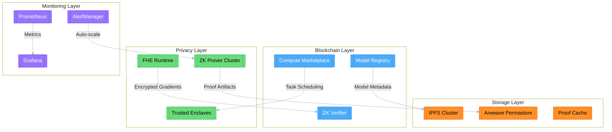

# Haunti - Decentralized Verifiable AI Infrastructure [v1.3.0]

**Haunti is an open-source AI infrastructure framework built on Solana, empowering users to self-deploy and manage decentralized AI models through modular toolkits.**

[](https://opensource.org/license/agpl-3-0/)
[](https://solana.com)
[](https://developer.nvidia.com/cuda-toolkit)

## 🌐 Connect with Us

- 🔗 [Website](https://hauntiai.com/)   - 🐦 [Twitter](https://twitter.com/Hauntionx)   - ✍️ [Medium](https://medium.com/@Hauntiai) 

## 🛠 Tech Stack

**Core Components**  


**Monitoring**  


**Deployment**  


---
## Haunti Architecture

---

## 🌟 Key Innovations

### 1. **Cryptographic AI Integrity Layer**
   - **Hybrid Proof System**: Combine ZK-SNARKs (Plonky3) and FHE (TFHE) for end-to-end verifiability
   - **Multi-Chain Attestation**: Cross-chain state proofs via Wormhole/ICS
   - **Data Lineage**: Immutable dataset provenance using IPFS+Arweave

### 2. **Decentralized Compute Network**
   - **GPU Orchestration**: Kubernetes-based scheduling with NVIDIA MIG support
   - **Elastic Scaling**: Auto-scale GPU pods based on ZK proof complexity
   - **Fault Tolerance**: Byzantine-resistant task replication

### 3. **Enterprise Security Suite**
   - **Hardened Runtime**: SGX/TEE support for sensitive operations
   - **Compliance Ready**: HIPAA/GDPR-compatible data handling
   - **Zero-Trust Architecture**: SPIFFE-based service identity

---

## 🏗 System Architecture

### Core Components

| Component | Tech Stack | Function |
|-----------|------------|----------|
| **Solana Programs** | Rust/Anchor | On-chain verification & governance |
| **ZK Prover Cluster** | Plonky3/CUDA | GPU-accelerated proof generation |
| **FHE Runtime** | TFHE-rs/C++ | Encrypted model operations |
| **Data Layer** | IPFS/Arweave/Ceramic | Decentralized storage with provenance |
| **Monitoring** | Prometheus/Loki/Tempo | Distributed tracing & metrics |


---

## 🛠 Installation & Configuration

### Hardware Requirements

| Component | Minimum | Recommended |
|-----------|---------|-------------|
| GPU | NVIDIA T4 (8GB) | A100 (40GB) |
| CPU | 4 cores | 16 cores EPYC |
| Memory | 32GB DDR4 | 256GB DDR5 |
| Storage | 500GB NVMe | 10TB NVMe RAID |

### 1. Base System Setup

```bash
# Ubuntu 22.04 LTS
sudo apt install -y \
  nvidia-cuda-toolkit \
  nvidia-docker2 \
  containerd.io \
  solana-cli=1.17.5

# Configure NVIDIA Container Runtime
sudo nvidia-ctk runtime configure --runtime=containerd
sudo systemctl restart containerd
```

### Run Local Network
```
# Start validator with GPU support
solana-test-validator --gossip-host 127.0.0.1 \
  --geyser-plugin-config config/geyser.yml \
  --rpc-port 8899 \
  --enable-cpi-and-log-storage

# Deploy programs
anchor deploy --provider.cluster localhost
```

## 📚 Usage Examples

### 1. Encrypted Model Training
```
let model = EncryptedModel::new(fhe_scheme::TFHE)?;
let dataset = Dataset::from_ipfs(cid)?;
let result = model.train(
  &dataset,
  TrainingConfig {
    epochs: 100,
    batch_size: 32,
    proof_type: ZkProofType::Plonky3
  }
)?;
```

## 2. Cross-chain Inference
```
const proof = await generateInferenceProof(
  modelCID, 
  inputData, 
  {useGPU: true}
);

const tx = await program.methods
  .verifyInference(proof)
  .accounts({model: modelPDA})
  .rpc();
```


## ⚙ Configuration
### Key Files

| Path | Purpose |
|-----------|---------|
| config/prometheus.yml | Metrics scraping rules |
| deploy/terraform/main.tf | Cloud provisioning |
| anchor/programs/haunti | Solana program suite |
| web/app/utils/zkproof.ts | Web3 proof handling |

### Environment Variables
```
# .env.example
SOLANA_RPC="https://api.mainnet-beta.solana.com"
IPFS_API="https://ipfs.haunti.ai:5001"
CUDA_DEVICES="0,1" # GPU indices
ZK_CIRCUITS_PATH="./circuits"
```

## 🤝 Contributing
### Development Workflow
```
# 1. Create feature branch
git checkout -b feat/awesome-feature

# 2. Run tests
cargo test --features test,zk \
  && anchor test --skip-local-validator

# 3. Submit PR
gh pr create --fill --reviewer "@haunti/core-team"
```

### Code Standards
- Rust: Clippy lvl strict
- TS: Airbnb style + ESLint
- Commit: Conventional commits
- Docs: Rustdoc -> mdBook

## 📜 License
### AGPL-3.0 © Haunti Foundation

### Commercial licensing available for enterprise use.
